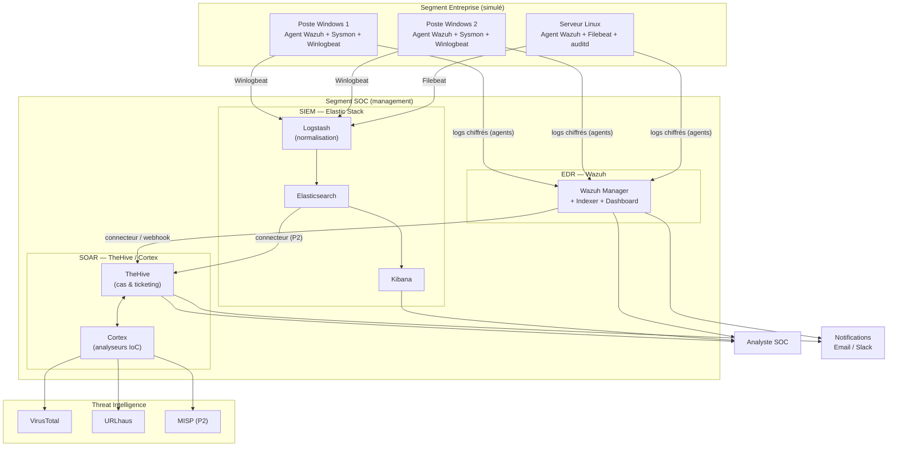

# Dossier d'Architecture Détaillée (DAT)
## SOC — Défi de Cybersécurité Opérationnelle · TechnoVision

| | |
|---|---|
| **Projet** | Cybersecurity Operations Challenge |
| **Client (fictif)** | TechnoVision |
| **Objet** | Architecture de la solution SOC (EDR + SIEM + SOAR) |
| **Auteur** | Kouamé Marc Bohoussou |
| **Formation** | La Plateforme — Cybersécurité opérationnelle |
| **Version** | 1.0 |
| **Statut** | À valider (en entreprise : validé par le RSSI) |
| **Date** | Septembre 2026 |

---

## 1. Objet du document

Ce dossier formalise l'architecture cible du centre opérationnel de sécurité (SOC) déployé pour TechnoVision : composants, flux de données, sources collectées, scénarios de détection basés sur les risques, et exigences techniques.

Il sert de référence pour les trois scénarios du défi (déploiement EDR, centralisation SIEM, automatisation SOAR) et fixe le **périmètre MVP** retenu compte tenu de la contrainte de temps.

---

## 2. Contexte et objectifs

### 2.1 Contexte

TechnoVision ne dispose ni de solution EDR, ni de collecte centralisée des logs, ni de processus d'analyse et de réponse. Des comportements suspects ont été observés sur plusieurs postes : connexions à des domaines inconnus, exécutions PowerShell inhabituelles, modifications de registre suspectes. Le SOC doit permettre de **détecter, analyser et répondre** à ces menaces, en s'appuyant sur des datasets simulant les modes opératoires **APT29** et **APT28**.

### 2.2 Objectifs du SOC

| # | Objectif | Indicateur |
|---|----------|-----------|
| O1 | Visibilité endpoint (EDR) sur postes Windows et Linux | ≥ 3 agents actifs, logs remontés |
| O2 | Détection des comportements suspects | Alertes générées et classées par criticité |
| O3 | Corrélation multi-sources et catégorisation MITRE ATT&CK | Chaînes d'attaque reconstruites |
| O4 | Investigation et réponse | ≥ 3 incidents analysés, IoC identifiés |
| O5 | Réduction du temps de détection / réponse | MTTD et MTTR mesurés avant/après automatisation |

### 2.3 Périmètre MVP

Le délai (10 jours) impose une priorisation. Le SOC est livré selon un principe **« démontrable de bout en bout d'abord, extensions ensuite »** :

- **Cœur livré (P1)** : EDR Wazuh complet, détection, investigation, réponse automatisée.
- **Étendu (P2)** : SIEM Elastic (mono-nœud), SOAR TheHive/Cortex en version minimale, une intégration EDR→SOAR fonctionnelle.
- **Perspectives (documentées, non réalisées)** : cluster Elastic multi-nœuds, sources réseau/web, MISP, détection ML, honeypots, tests d'intrusion Atomic Red Team.

---

## 3. Architecture cible

### 3.1 Schéma d'architecture

### 3.2 Composants

| Composant | Rôle | Priorité |
|-----------|------|----------|
| **Wazuh Manager** | EDR : collecte agents, règles de détection, FIM, SCA, réponse active | P1 |
| **Agents Wazuh** | Télémétrie endpoints (2 Windows, 1 Linux) | P1 |
| **Sysmon** | Enrichissement de la télémétrie Windows (process, réseau, registre) | P1 |
| **Elastic Stack** | SIEM : centralisation, corrélation multi-sources, dashboards | P2 |
| **Logstash** | Pipelines de normalisation des formats de logs | P2 |
| **TheHive** | Gestion des cas, ticketing, escalade | P2 |
| **Cortex** | Analyse et enrichissement automatisés des IoC | P2 |
| **Cortex analyzers** | VirusTotal, URLhaus (MISP en P2) | P2 |

### 3.3 Flux de données

1. **Collecte EDR** : les agents Wazuh envoient la télémétrie chiffrée (port 1514/TCP) au Manager, qui applique les règles de détection.
2. **Collecte SIEM** : Winlogbeat (Windows) et Filebeat (Linux) envoient les logs à Logstash, qui normalise puis indexe dans Elasticsearch ; Kibana visualise.
3. **Orchestration** : les alertes Wazuh (et Elastic en P2) déclenchent la création automatique de cas dans TheHive ; Cortex enrichit les IoC via les sources de Threat Intelligence.
4. **Réponse** : playbooks d'isolation / remédiation exécutés par la réponse active Wazuh, notifications envoyées par email/Slack.

---

## 4. Sources de logs à collecter (« technologies à collecter »)

| Source | Collecteur | Journaux / événements clés | Objectif |
|--------|-----------|----------------------------|----------|
| Windows — Security | Agent Wazuh / Winlogbeat | 4624/4625 (logon), 4648, 4672, 4688 (process) | Authentification, exécution |
| Windows — System / Application | Agent Wazuh | Services, erreurs applicatives | Détection anomalies système |
| Windows — PowerShell | Agent Wazuh / Sysmon | 4103/4104 (script block), commandes encodées | Détection PowerShell malveillant |
| Windows — Sysmon | Sysmon + Wazuh | 1 (process), 3 (réseau), 11 (fichier), 13 (registre) | Télémétrie fine, C2, persistance |
| Linux — auth / syslog | Agent Wazuh / Filebeat | `/var/log/auth.log`, `/var/log/syslog` | Accès, sudo, SSH |
| Linux — auditd | auditd + Wazuh | exécutions, accès fichiers sensibles | Traçabilité système |
| FIM (Windows + Linux) | Module Wazuh FIM | Modifications fichiers & clés de registre | Intégrité, persistance |
| SCA | Module Wazuh SCA | Écarts de configuration (CIS) | Durcissement |
| Réseau — pfSense/Fortinet *(P2)* | Filebeat/syslog | Connexions, blocages firewall | Flux réseau anormaux |
| Web — Apache/Nginx *(P2)* | Filebeat | Access/error logs | Détection attaques web |

---

## 5. Analyse de risques → scénarios de détection

Chaque risque identifié se traduit par un scénario de détection, une technique **MITRE ATT&CK** et une source de collecte. C'est la colonne vertébrale du SOC.

| # | Risque / comportement | Scénario de détection | Technique ATT&CK | Source |
|---|-----------------------|-----------------------|------------------|--------|
| R1 | Exécution PowerShell obfusquée / encodée | Détection commandes `-enc`, script block 4104 suspect | T1059.001 (PowerShell) | PowerShell / Sysmon |
| R2 | Persistance via clés de registre (Run) | FIM sur `...\CurrentVersion\Run`, Sysmon 13 | T1547.001 (Registry Run Keys) | Wazuh FIM / Sysmon |
| R3 | Communication C2 vers domaine inconnu | Connexions sortantes anormales, DNS suspects | T1071 (App Layer Protocol) | Sysmon 3 / DNS |
| R4 | Vol d'identifiants (accès LSASS) | Accès processus LSASS non légitime | T1003.001 (LSASS Memory) | Sysmon 10 |
| R5 | Mouvement latéral (RDP / SMB / PsExec) | Logons réseau anormaux 4624 type 3/10, 4648 | T1021 (Remote Services) | Windows Security |
| R6 | Tâche planifiée / service malveillant | Création tâche (4698) ou service (7045) | T1053 / T1543 | Windows Security/System |
| R7 | Effacement de traces | Journal d'audit vidé (1102) | T1070.001 (Clear Windows Logs) | Windows Security |
| R8 | Exfiltration de données | Volume sortant anormal, canaux alternatifs | T1041 / T1048 (Exfiltration) | Sysmon 3 / réseau (P2) |
| R9 | Compromission initiale par phishing | Pièce jointe → exécution enfant suspecte | T1566 (Phishing) | Dataset APT / Sysmon 1 |
| R10 | Écart de configuration exploitable | Non-conformité CIS détectée | — (durcissement) | Wazuh SCA |

> Les datasets **APT29** (spearphishing, PowerShell, WMI, tâches planifiées, credential access) et **APT28** (spearphishing, récolte d'identifiants, mouvement latéral) permettent de valider R1–R9 sur des chaînes d'attaque réalistes.

---

## 6. Exigences techniques

### 6.1 Dimensionnement (capacity planning)

| Composant | vCPU | RAM | Disque | Remarque |
|-----------|------|-----|--------|----------|
| Wazuh (all-in-one) | 4 | 8 Go | 50 Go | Min. 2 vCPU / 4 Go |
| Elastic (mono-nœud) | 2 | 4 Go | 50 Go | Cluster 2 nœuds = perspective (P2) |
| TheHive + Cortex + backend | 4 | 8 Go | 50 Go | Cassandra + Elasticsearch embarqués |
| Poste Windows ×2 | 2 | 4 Go | 40 Go | |
| Serveur Linux | 1 | 2 Go | 20 Go | |

**Contrainte clé** : faire tourner l'ensemble simultanément demande ~24–32 Go de RAM. Stratégie retenue : **travailler stack par stack**, éteindre les composants inutilisés, ne réunir les 3 stacks que pour la démonstration finale d'intégration. Hébergement possible : local (VirtualBox/VMware + Docker), droplet cloud, ou instance Wazuh cloud fournie.

### 6.2 Rétention

- **Elasticsearch** : 7 jours minimum (ILM policy).
- **Wazuh** : conservation des alertes par défaut, archives activées.

### 6.3 Sécurité de la plateforme SOC

- **Chiffrement** : TLS sur Kibana, Wazuh Dashboard, TheHive ; communication agents chiffrée.
- **Authentification / RBAC** : comptes dédiés, rôles analystes vs admin.
- **Enrôlement** : clés d'agent Wazuh, pas d'enrôlement anonyme.
- **Segmentation** : segment SOC (management) isolé du segment entreprise ; poste analyste séparé.

---

## 7. Méthodologie opérationnelle

Le SOC suit le cycle : **Préparation** (déploiement, intégrations, validation) → **Détection & analyse** (règles, alertes, investigations, MITRE ATT&CK) → **Réponse & automatisation** (procédures, playbooks, remédiation) → **Documentation & reporting** (rapports d'incident, journal des actions).

---

## 8. Périmètre livré vs perspectives

| Livré (MVP) | Perspectives (documentées) |
|-------------|----------------------------|
| EDR Wazuh complet (FIM, SCA, réponse active) | Cluster Elastic multi-nœuds |
| Détection + investigation de 3 incidents | Sources réseau (pfSense/Fortinet) et web (Apache/Nginx) |
| 2 playbooks de réponse testés | Instance MISP + partage de Threat Intelligence |
| SIEM Elastic mono-nœud + règles | Détection avancée par Machine Learning |
| SOAR minimal + 1 intégration EDR→SOAR | Honeypots (T-Pot), tests Atomic Red Team |

---

## 9. Références

- Documentation Wazuh — https://documentation.wazuh.com/
- Documentation Elastic — https://www.elastic.co/guide/index.html
- Documentation TheHive — https://docs.thehive-project.org/
- MITRE ATT&CK — https://attack.mitre.org/
- Sigma Rules — https://github.com/SigmaHQ/sigma
- NIST SP 800-61 — Computer Security Incident Handling Guide

---
*Document de travail — Cybersecurity Operations Challenge · La Plateforme*
