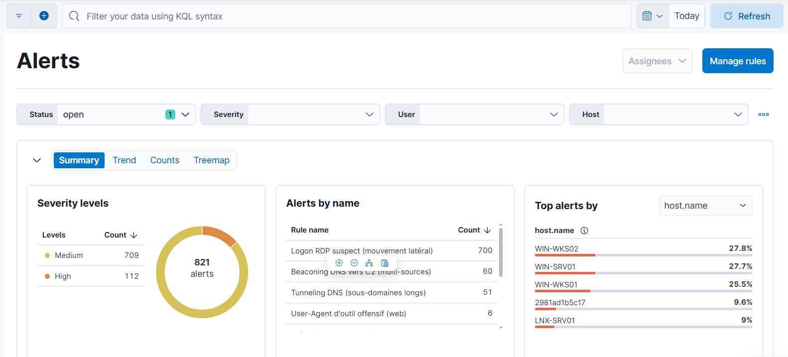

# Rapport — Scénario 2 : Centralisation et corrélation des logs de sécurité (SIEM)

**Projet :** Cybersecurity Operations Challenge — client fictif *TechnoVision*
**Scénario :** 2 — Solution SIEM (Elastic Stack)
**Auteur :** Marc Bohoussou
**Formation :** La Plateforme — Cybersécurité opérationnelle
**Date :** Septembre 2026
**Fil rouge :** MITRE ATT&CK

---

## Sommaire

1. Contexte et objectifs
2. Architecture de la solution
3. Déploiement du cluster Elastic
4. Données : dataset synthétique
5. Ingestion et normalisation (Logstash)
6. Collecte de logs réels via Elastic Agent
7. Détection : règles SIEM (Elastic + Sigma)
8. Amélioration continue : faux positifs
9. Visualisation : dashboards
10. Investigations d'incidents
11. Difficultés rencontrées et solutions
12. Correspondance avec les livrables attendus
13. Limites et perspectives
14. Conclusion

---

## 1. Contexte et objectifs

TechnoVision souhaite améliorer sa capacité de détection en centralisant et corrélant
les logs de différentes sources (systèmes, applications, équipements réseau), face à un
volume important et au besoin d'identifier rapidement les incidents parmi le bruit de fond.

**Objectifs du scénario :**
- Déployer un SIEM Elastic (cluster ≥ 2 nœuds, sécurisé).
- Intégrer plusieurs sources de logs et normaliser les formats.
- Développer ≥ 10 règles de détection, mappées MITRE ATT&CK.
- Construire des tableaux de bord de supervision.
- Investiguer des incidents multi-sources et reconstruire leur chronologie.

> **Note de périmètre :** les ressources (datasets, environnement) n'ayant pas été
> fournies, deux sources de données ont été mises en œuvre : un **dataset synthétique
> multi-sources** conçu et documenté (§4), et un **endpoint Linux réel** collecté par
> Elastic Agent (§6). Le SIEM traite les deux dans un schéma ECS unifié.

---

## 2. Architecture de la solution

Cluster Elastic **2 nœuds** sécurisé (TLS + authentification), déployé via Docker Compose.
Les sources — synthétiques (fichiers) et réelle (Elastic Agent) — sont normalisées en ECS
par Logstash, puis exploitées dans Kibana (détection, dashboards, investigations).


*Figure 1 — Flux de bout en bout : 6 sources de logs → Logstash (parsing + ECS) → Elasticsearch (2 nœuds, TLS) → Kibana (SIEM, règles, dashboards).*

| Composant | Rôle |
|-----------|------|
| Elasticsearch (es01, es02) | Stockage/recherche, cluster 2 nœuds, sécurité activée |
| Logstash | Ingestion (fichiers + beats), parsing (grok/csv/json), normalisation ECS |
| Kibana | Discover, règles de détection, dashboards, Timeline |
| Elastic Agent | Collecte des logs d'un endpoint Linux réel (§6) |

Voir le Dossier d'Architecture Détaillée : [`../architecture/DAT-SOC-TechnoVision.md`](../architecture/DAT-SOC-TechnoVision.md).

---

## 3. Déploiement du cluster Elastic

Déploiement via `docker-compose.yml` : génération automatique des certificats (service
`setup`), 2 nœuds Elasticsearch, Kibana et Logstash. Sécurité activée par défaut
(TLS de bout en bout, authentification native, licence *basic*).

Prérequis clé : `vm.max_map_count=262144` (sans quoi Elasticsearch ne démarre pas).


*Figure 2 — Conteneurs du stack actifs : `es01-1`, `es02-1`, `kibana-1`, `logstash-1` (indicateur vert = en cours d'exécution).*

**Ticket : SCRUM-25** (déploiement ELK, 2 nœuds, TLS/auth) — réalisé.

---

## 4. Données : dataset synthétique

Un générateur Python (`tools/generate_logs.py`) produit un bruit de fond légitime et
injecte des scénarios d'attaque documentés, mappés MITRE ATT&CK.

```
python tools/generate_logs.py --hours 24 --eps 3 --seed 42 --recent
```

Options : `--recent` (logs sur la dernière heure, détection temps réel), `--eps` (volume),
`--seed` (reproductibilité). Sortie : un fichier par source + `ATTACK_MANIFEST.json`
(le « corrigé » listant chaque attaque, son horodatage et sa technique).

**Sources générées :** Windows Security, Sysmon, Linux auth, Web (Apache/Nginx),
Firewall pfSense, DNS.

**Attaques injectées :**

| Scénario | Technique MITRE |
|----------|-----------------|
| Bruteforce SSH → succès | T1110 |
| PowerShell encodé | T1059.001 |
| Création de compte | T1136 |
| Mouvement latéral RDP | T1021 |
| Scan web + exfiltration | T1046 / T1041 |
| Beaconing DNS (C2) | T1071.004 |
| Tunneling DNS | T1048.003 |
| Scan de ports (firewall) | T1046 |

Extrait réel de `data/ATTACK_MANIFEST.json` (le « corrigé ») :

```json
{
  "scenario": "bruteforce_ssh",
  "mitre": "T1110",
  "time_utc": "2026-09-21T07:42:05.000Z",
  "description": "Bruteforce SSH depuis 18.226.157.149 → succès sur 'admin' (corrélé firewall)"
},
{
  "scenario": "web_scan_exfil",
  "mitre": "T1046/T1041",
  "time_utc": "2026-09-21T07:43:55.000Z",
  "description": "Scan web (sqlmap) depuis 21.227.148.148 puis exfiltration volumineuse (corrélé firewall)"
}
```

> Le dataset est synthétique et assumé comme tel : l'objectif est de valider le pipeline,
> les règles et les investigations, pas de simuler un vrai parc.

---

## 5. Ingestion et normalisation (Logstash)

Le pipeline `logstash/pipeline/logstash.conf` lit les sources, applique un parsing adapté
et normalise vers **ECS** :

| Source | Entrée | Parsing | Index |
|--------|--------|---------|-------|
| Windows / Sysmon | fichier (JSON) | codec json | `soc-windows-*` / `soc-sysmon-*` |
| Linux auth | fichier + **beats** | grok (SSH/sudo) | `soc-linux-*` |
| Web | fichier | grok COMBINEDAPACHELOG | `soc-web-*` |
| Firewall pfSense | fichier | grok + csv (filterlog) | `soc-firewall-*` |
| DNS dnsmasq | fichier | grok | `soc-dns-*` |

Un **index template** (`soc-mapping`) impose les types corrects avant ingestion :
`source.ip` en `ip`, ports en `integer`, champs catégoriels en `keyword` — indispensable
pour les agrégations des règles *threshold*.


*Figure 3 — Index Management : les 6 index `soc-*` en statut `green`, avec leur nombre de documents (de 26 213 pour `soc-dns` à 56 709 pour `soc-windows`).*


*Figure 4 — Vue Discover filtrée sur `event.dataset : "web.access"` (13 603 documents) : les champs ECS (`event.action`, `http.response.status_code`, `http.request.method`…) sont correctement extraits par le pipeline.*

**Ticket : SCRUM-28** (pipelines Logstash) — réalisé.

---

## 6. Collecte de logs réels via Elastic Agent

Au-delà du dataset synthétique (banc de test), un **endpoint Linux réel** a été intégré au
SIEM afin de le démontrer en conditions réelles. Cette collecte alimente les **mêmes index
`soc-*`** et les **mêmes règles** que les sources synthétiques, sans duplication de schéma.

### 6.1 Architecture de collecte

```
VM Ubuntu (SOC-LNX-01, arm64)                 Hôte / Docker
┌───────────────────────────┐                 ┌─────────────────────────────┐
│ auth.log / auditd / syslog │                 │  Logstash (beats:5044)      │
│           │                │   TCP 5044      │      │ parsing + ECS         │
│   Elastic Agent 8.15.3 ────┼────────────────▶│      ▼                      │
│   (standalone)             │                 │  Elasticsearch  soc-linux-* │
└───────────────────────────┘                 └─────────────────────────────┘
```

| Élément | Valeur |
|---------|--------|
| VM cible | SOC-LNX-01 — Ubuntu Server 24.04 LTS **ARM64** |
| Réseau | Switch Hyper-V interne `LAB-SOC`, VM `192.168.56.20`, hôte `192.168.56.1` |
| Agent | Elastic Agent 8.15.3 standalone (build linux-arm64) |
| Sources | `/var/log/auth.log`, `/var/log/audit/audit.log`, `/var/log/syslog` |
| Transport | Elastic Agent → Logstash (input `beats`, port 5044) |

> Contrainte matérielle assumée : l'hôte étant en ARM64 (Snapdragon X), la VM invitée et
> l'agent sont impérativement en arm64 (amd64 ne démarre pas sous Hyper-V ARM). Le service
> Hyper-V *Heartbeat* a dû être désactivé pour éviter un kernel panic ARM64.


*Figure 5 — `sudo elastic-agent status` sur SOC-LNX-01 : composant `elastic-agent` **HEALTHY / Running**.*

### 6.2 Unification avec le schéma existant

L'Elastic Agent émet dans un format différent du dataset synthétique. Deux écarts ont été
résolus dans le pipeline pour que la collecte réelle soit exploitable par les règles
existantes, **sans modifier aucune règle** :

1. **Horodatage ISO8601** : l'agent envoie `2026-09-22T11:13:52.392Z` (vs syslog
   `Sep 22 11:13:52`). Le grok Linux gère désormais les deux formats
   (`TIMESTAMP_ISO8601` + `SYSLOGTIMESTAMP`).
2. **`event.dataset`** : l'agent étiquette les logs SSH en `system.auth`, alors que les
   règles filtrent `linux.auth`. Le pipeline ajoute systématiquement `linux.auth`, produisant
   le tableau `["system.auth", "linux.auth"]` — les règles captent le trafic réel sans
   modification.

> Résultat : un événement réel `Failed password for invalid user baduser from 127.0.0.1`
> est parsé avec `source.ip`, `user.name`, `event.action`, `event.outcome` renseignés,
> exactement comme un événement synthétique.

### 6.3 Détection sur données réelles

Une attaque par force brute SSH générée contre la VM a franchi le seuil de la règle
**SSH Bruteforce** et déclenché des alertes — sur du trafic réel, sans configuration
spécifique.


*Figure 6 — Vue Alerts : 2 alertes ouvertes « SSH Bruteforce — échecs multiples », sévérité **Medium**, score de risque 47, source `127.0.0.1` — déclenchées par le trafic réel de la VM Linux.*

---

## 7. Détection : règles SIEM (Elastic + Sigma)

**10 règles Elastic** importées via un fichier NDJSON versionné
(`siem-rules/soc_detection_rules.ndjson`). Chaque règle porte sa technique MITRE, sa
sévérité et son score de risque. Types : *query* (KQL) et *threshold* (agrégation).


*Figure 7 — Les 10 règles personnalisées installées (Security → Rules), avec leur sévérité et leur score de risque.*

| # | Règle | Type | Sévérité | Risk score | MITRE |
|---|-------|------|----------|:----------:|-------|
| 1 | SSH Bruteforce — échecs multiples | threshold | Medium | 47 | T1110 |
| 2 | PowerShell encodé / obfusqué | query | High | 73 | T1059.001 |
| 3 | Création de compte utilisateur | query | Medium | 47 | T1136 |
| 4 | Logon RDP suspect (mouvement latéral) | query | Medium | 47 | T1021 |
| 5 | User-Agent d'outil offensif (web) | query | Medium | 47 | T1595 |
| 6 | Scan de ports (firewall) | threshold | Medium | 47 | T1046 |
| 7 | Beaconing DNS vers C2 (multi-sources) | query | High | 73 | T1071.004 |
| 8 | Tunneling DNS (sous-domaines longs) | query | High | 73 | T1048.003 |
| 9 | Exfiltration de données via endpoint | query | Critical | 90 | T1041 |
| 10 | Intrusion SSH réussie après bruteforce | threshold | High | 73 | T1110 (corrélation) |

Points notables : la règle #7 couvre **deux index** (`soc-dns-*` + `soc-sysmon-*`) =
détection **multi-sources** ; la #10 corrèle le succès SSH au bruteforce.


*Figure 8 — Sur l'ensemble du dataset : 821 alertes générées (709 Medium, 112 High), dominées par « Logon RDP suspect » (700), « Beaconing DNS vers C2 » (60) et « Tunneling DNS » (51) — preuve que le ruleset réagit activement au volume de bruit + attaques injecté.*

**Portabilité — règles Sigma.** En complément, **4 règles au format Sigma** (dossier
`sigma/`) fournissent les détections dans un format indépendant du SIEM, convertibles vers
Elasticsearch via `sigma-cli` :

| Fichier Sigma | MITRE |
|---------------|-------|
| `ssh_bruteforce.yml` | T1110 |
| `powershell_encoded_command.yml` | T1059.001 |
| `dns_c2_beacon.yml` | T1071.004 |
| `web_offensive_useragent.yml` | T1595 |

**Ticket : SCRUM-27** (≥ 10 règles + MITRE + Sigma) — réalisé.

---

## 8. Amélioration continue : faux positifs

La règle « Intrusion SSH réussie » générait initialement **51 alertes**, en grande partie
des faux positifs : des connexions SSH `admin` **internes légitimes** (subnet 10.10.20.0/24).

**Analyse :** l'attaquant réel se distingue non par le volume mais par son origine externe.
La requête a été affinée pour exclure le réseau interne :

```
event.dataset : "linux.auth" and event.outcome : "success"
  and user.name : "admin" and not source.ip : "10.10.20.0/24"
```

Résultat : détection ciblée sur la seule IP externe malveillante ; les faux positifs
historiques ont été marqués *closed / false positive*.

**Enseignement :** le top des IP par volume est trompeur (dominé par le trafic interne) ;
la détection pertinente repose sur le **comportement** (échecs répétés depuis une IP externe).

---

## 9. Visualisation : dashboards

Dashboard `SOC — Supervision générale` (6 panels), exporté en NDJSON
(`dashboard/export.ndjson`) :


*Figure 9 — Volume de logs par source dans le temps : pic à ~33 000 événements/30 min, dominé par `windows.security` / `network.firewall` / `windows.sysmon` — sert de tableau de bord de la **qualité des collectes**.*


*Figure 10 — Répartition des sources : `network.firewall` (20,3 %), `windows.security` (21,7 %), `windows.sysmon` (17,9 %), `linux.auth` (15,0 %), `web.access` (15,0 %), autres (10,2 %).*


*Figure 11 — Top 10 IP sources (point d'entrée d'investigation) : trafic interne dominant sur le subnet `10.10.20.0/24`.*


*Figure 12 — Authentifications SSH dans le temps : pic de connexions sur la fenêtre observée (jusqu'à ~2 500 événements/30 min).*


*Figure 13 — Top des domaines DNS interrogés : présence de `bffqcbmw.evil-c2.net` (C2/tunneling) au milieu du trafic légitime (`cloudflare.com`, `github.com`, `google.com`…).*

Un 6ᵉ panel, **Top ports bloqués / firewall** (scans), complète le dashboard dans l'export
NDJSON.

**Ticket : SCRUM-29** (dashboards + qualité des collectes) — réalisé.

---

## 10. Investigations d'incidents

Deux incidents investigués via **Timeline**, avec reconstruction chronologique.

### Incident #01 — Bruteforce SSH (T1110)

- **Cible :** compte `admin` sur le dataset synthétique (`18.226.157.149`) ; scénario
  reproduit également sur l'endpoint **réel** (`127.0.0.1`, §6.3).
- **Déroulé :** rafale d'échecs SSH (`Failed`) depuis la même IP, suivie d'une connexion
  réussie (`Accepted`) à 09:43:07 — franchissement du seuil de la règle #1.


*Figure 14 — Timeline « Investigation - Bruteforce SSH (T1110) », requête `event.dataset : "linux.auth" and source.ip : "18.226.157.149"` : succession d'échecs (`Failed`) puis connexion réussie (`Accepted`) sur le compte `admin`.*

### Incident #02 — Scan web → Exfiltration (T1046 → T1041) — *multi-sources*

- **Attaquant :** `21.227.148.148` (externe).
- **Déroulé (UTC) :** scan sqlmap à 07:43:55 (chemins `/admin`, `/.env`,
  `/../../etc/passwd`, `/backup.zip`…), puis à 07:44:35 un `POST /api/export` renvoyant
  **~37 Mo** (exfiltration), User-Agent `curl/8.0`.
- **Corrélation :** l'IP apparaît dans les logs **web** ET **firewall** (flux sortant),
  confirmant l'exfiltration. Durée : ~40 secondes.

**Ticket : SCRUM-30** (≥ 2 incidents multi-sources + faux positifs) — réalisé.

---

## 11. Difficultés rencontrées et solutions

| Difficulté | Cause | Solution |
|------------|-------|----------|
| Aucune donnée dans les règles/dashboards | Logs historiques hors de la fenêtre de temps | Option `--recent` : horodatage sur la dernière heure |
| Erreur `Fielddata is disabled on [source.ip]` | Champ indexé en `text`, non agrégeable | Index template imposant `source.ip` en type `ip` |
| Filtres web sans résultat (`source.ip`, `url.path`) | Le mode ECS de Logstash nomme les champs `source.address` / `url.original` | Adaptation des requêtes aux vrais noms ECS |
| 51 faux positifs sur l'intrusion SSH | Règle trop large (logins internes légitimes) | Exclusion du subnet interne (§8) |
| Règles perdues au redémarrage | Clé de chiffrement Kibana non persistante | Ajout de `xpack.encryptedSavedObjects.encryptionKey` |
| VM amd64 ne démarre pas / kernel panic | Hôte ARM64 (Hyper-V ARM) | VM et agent en arm64 ; service Heartbeat désactivé |
| Logs réels non parsés (`_grok_linux_fail`) | Agent en horodatage ISO8601 (≠ syslog) | Ajout du pattern `TIMESTAMP_ISO8601` au grok |
| Règles ne détectent pas le trafic réel | Agent étiquette `system.auth`, règles filtrent `linux.auth` | Ajout systématique de `linux.auth` (tableau des deux) |

> Ces itérations reflètent un vrai cycle de detection engineering : déployer, observer,
> diagnostiquer, corriger.

---

## 12. Correspondance avec les livrables attendus

| Livrable (sujet) | Réalisé | Référence |
|------------------|---------|-----------|
| Architecture SIEM (DAT) | ✅ | `../architecture/` |
| Déploiement ELK, 2 nœuds, TLS/auth | ✅ | `docker-compose.yml` (§3) |
| Intégration multi-sources + pipelines Logstash | ✅ | `logstash/` (§5) |
| Collecte d'un endpoint réel (Elastic Agent) | ✅ | §6 |
| ≥ 10 règles de détection + MITRE | ✅ | `siem-rules/` (§7) |
| Règles basées sur le framework Sigma | ✅ | `sigma/` (§7) |
| Dashboards + qualité des collectes | ✅ | `dashboard/export.ndjson` (§9) |
| Investigations multi-sources + faux positifs | ✅ | §8, §10 (ce rapport) |

---

## 13. Limites et perspectives

- **Données hybrides** : dataset synthétique (couverture multi-sources) + endpoint Linux
  réel. Perspective : ajouter d'autres endpoints réels (le pipeline le permet sans
  modification côté Elasticsearch).
- **Windows en ARM64** : pas de build Elastic Agent/Beats Windows ARM64 (matrice officielle
  Elastic = Windows x86_64). Les logs Windows restent synthétiques ; piste documentée :
  collecte PowerShell → API `_bulk`, ou VM Windows x64 sur une autre machine.
- **NAT Hyper-V** : les attaques depuis Kali sont vues avec l'IP de l'hôte
  (`192.168.56.1`). La détection reste valide ; seule l'attribution d'IP source distincte
  est limitée.
- **Cluster local mono-machine** : 2 nœuds sur un même hôte. Perspective : nœuds répartis.
- **Perspectives sujet** : politique de rétention ILM 7 jours, intégration Threat
  Intelligence (MISP), détection par Machine Learning.

---

## 14. Conclusion

Le SIEM déployé remplit les objectifs du scénario : centralisation de sources hétérogènes
(synthétiques et réelle), normalisation ECS unifiée, dix règles de détection mappées MITRE
ATT&CK complétées de règles Sigma portables, tableaux de bord de supervision, et
investigation de deux incidents multi-sources avec reconstruction chronologique.

L'intégration d'un **endpoint Linux réel** via Elastic Agent, et la **détection prouvée sur
ce trafic réel**, démontrent le fonctionnement de la solution en conditions réelles. Le
travail d'affinage des faux positifs et la résolution des nombreuses difficultés techniques
(mapping, formats, contraintes ARM64) illustrent une démarche opérationnelle de detection
engineering, au-delà de la simple mise en place d'outils.
